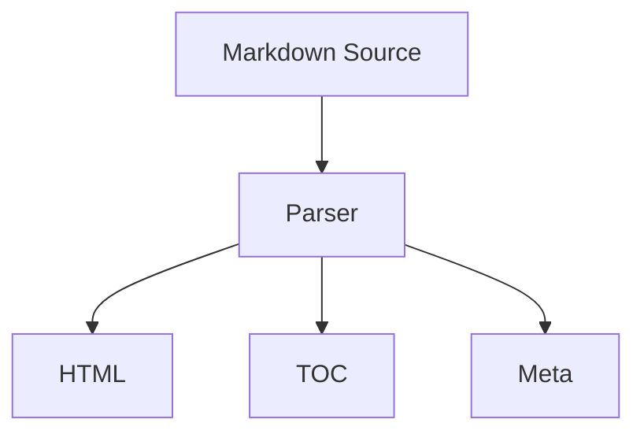

> 이 문서는 콘텐츠 엔진 스파이크를 위해 다양한 Markdown 기능을 한 번에 담아둔 샘플입니다.

## 왜 이 샘플이 필요한가

이 포스트는 단순한 본문 렌더를 넘어서 아래 항목을 동시에 확인하기 위한 데이터 셋입니다.

- frontmatter 파싱
- category / tag 구조
- heading 기반 TOC 생성
- 코드 블록 감지
- 표, 체크리스트, 인용구, HTML 블록 처리
- 외부 링크 처리
- 읽기 시간과 단어 수 계산

### 기대하는 UI 활용 시나리오

1. 홈과 포스트 목록에서 요약 카드 렌더링
2. 상세 페이지에서 TOC와 메타 정보 노출
3. 태그 및 카테고리 필터 UI에서 canonical 값 사용

## 레이아웃 참고 기준

우리는 Jekyll 기반의 Chirpy 블로그 테마를 강하게 참고할 예정입니다.

<aside class="rounded-lg border border-zinc-200 bg-zinc-50 p-4">
  이 HTML 블록은 rehype-raw 경로가 정상적으로 동작하는지 확인하기 위한 예시입니다.
</aside>

### 콘텐츠 메타 예시

| 항목     | 값             |
| -------- | -------------- |
| 작성일   | 2026-04-19     |
| 카테고리 | Tech/SvelteKit |
| 태그 수  | 4              |
| TOC      | 활성화         |

## 체크리스트 블록

- [x] 샘플 frontmatter 준비
- [x] rich markdown 본문 준비
- [ ] UI 쉘과 데이터 연결
- [ ] SQLite 인덱싱 연결

## 코드 블록 예시

```ts
type PostCard = {
	slug: string;
	title: string;
	description: string;
	category: string;
	tags: string[];
	publishedAt: string;
};

export function toPostCard(input: Record<string, unknown>): PostCard {
	return {
		slug: String(input.slug ?? ''),
		title: String(input.title ?? ''),
		description: String(input.description ?? ''),
		category: String(input.category ?? ''),
		tags: Array.isArray(input.tags) ? input.tags.map(String) : [],
		publishedAt: String(input.date ?? '')
	};
}
```

### 외부 링크 예시

- [SvelteKit 공식 문서](https://svelte.dev/docs/kit)
- [Tailwind CSS 문서](https://tailwindcss.com/docs)

## 수식과 다이어그램 메타 감지 예시

아래 내용은 1단계 스파이크에서는 고급 렌더링까지 하지 않더라도, 콘텐츠 메타 감지 기준으로는 유용합니다.

인라인 수식 예시: $E = mc^2$

블록 수식 예시:

$$
\int_0^1 x^2 \, dx = \frac{1}{3}
$$



## 후속 구현 힌트

### 상세 페이지에 필요한 데이터 shape

- slug
- relativePath
- frontmatter
- html
- toc
- content meta

### 목록 페이지에 필요한 데이터 shape

- title
- description
- published date
- category
- tags
- reading time
- cover image metadata

## 마무리

이 샘플은 “UI를 먼저 크게 만들기 전에, 실제 콘텐츠 데이터가 어떤 모양으로 나오는지 확인하기 위한 안전한 기준점” 역할을 합니다.
